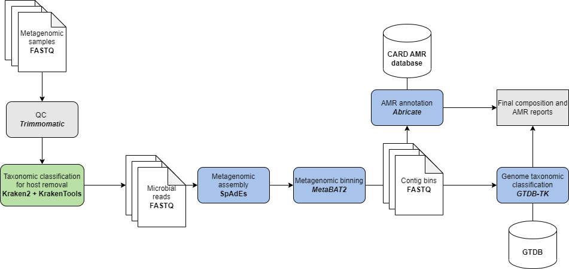

# Supplementary information

This document includes additional information and materials related to the bioinformatic analysis described in the manuscript **Metagenomic characterization of lung aspirates from non-pulmonary sepsis patients: association of antibiotic resistance and patient mortality**. 

# Metagenomic samples repository
Microbiome samples in FASTA format are shared in the following repository:
[EGA Link for samples (TO DO)](www.google.es)
NOTE: All detetcted human reads in raw sample sequences have been removed prior to upload

# Bioinformatic analysis: Software versions and  parameters
The workflow used for analyzing these samples:

## Quality control

**[Trimmomatic](https://github.com/usadellab/Trimmomatic) v0.39** 

    trimmomatic  PE -phred33 LEADING:3  TRAILING:3  SLIDINGWINDOW:4:15  MINLEN:50

## Host reads removal

**[Kraken2](https://ccb.jhu.edu/software/kraken2/) v2.1.3**

    kraken2  --db  db/k2_pluspf_20210517

**[KrakenTools](https://ccb.jhu.edu/software/krakentools/) v1.2**

    extract_kraken_reads.py -t 9606 --exclude --include-children

## Metagenomic assembly

**[Spades](https://github.com/ablab/spades) v3.15.1** 

    spades.py --meta

## Metagenomic binning

**[MetaBAT2](https://bitbucket.org/berkeleylab/metabat/src/master/) v2.15** 

    metabat2  --minContig  1500  --minClsSize  10000

## Taxonomic classification of recovered genoms

**[GTDB-tk](https://github.com/Ecogenomics/GTDBTk) v2.2.0** 

    classify_wf

## AMR annotation

**[Abricate](https://github.com/tseemann/abricate/) v1.0**

    abricate --db card --mincov 85.0

